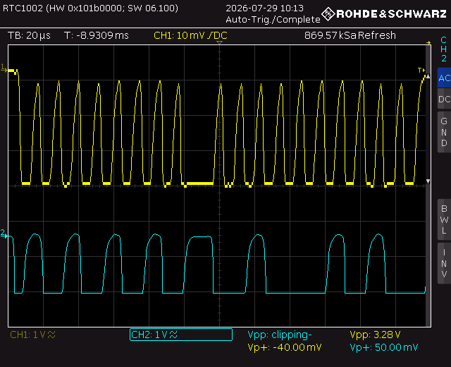

2. I2C 통신 (SDA끼리, SCL끼리)

- Intergreted Two-circuit 으로 두개의 선을 사용하는 동기식 직렬 통신
- Controller가 통신을 시작하고 SCL을 생성하고, 통신 대상은 주소를 통해 선택함. I2C는 기본적으로 7비트 주소를 사용하며, 각 바이트 뒤에는 ACK/NACK 비트가 추가됨

- 필요한 선 - SCL(Serial Clock Line),SDA(Serial Data Line),GND

<특징> 

- 여러 장치를 하나의 버스에 연결할 수 있고, 각 Slave는 주소를 가짐
```
Master → START → 7비트 주소 → R/W 1비트 → ACK → 데이터 8비트 → ACK/NACK → STOP
```
 - Open-Drain 방식이므로 풀업저항이 필요
 - 장치는 선을 직접 High로 만들지 않고, Low로만 당길 수 있음
```
장치가 Low 출력 → 선이 0V
아무도 Low로 당기지 않음 → 풀업저항이 High로 올림
```

<보드 & LCD>

- STM32 PB8 SCL ───── LCD SCL
- STM32 PB9 SDA ───── LCD SDA
- STM32 GND     ───── LCD GND
- STM32/LCD 전원 연결

## 주소 찾기
```
char msg[64];

while (1)
{
    uint8_t found = 0;

	// I2C의 가능한 7비트 주소를 하나씩 검사(0x00~0x7F 사이)
    for (uint8_t address = 1; address < 128; address++)
    {
        if (HAL_I2C_IsDeviceReady(
                &hi2c1, // I2C1 주변 장치 사용
                address << 1, // 7비트 주소를 한 칸 왼쪽으로 이동(주소가 R/W 비트 자리까지 포함될 수 있도록 왼쪽 정렬된 형태를 요구)
                2, // 응답 확인할 재시도 횟수
                20 // Timeout 시간
				) == HAL_OK) // 해당 주소의 장치가 ACK를 반환했다는 뜻
        {
            found = 1;

            snprintf(
                msg,
                sizeof(msg),
                "Found: 0x%02X\r\n",
                address
            );

            HAL_UART_Transmit(
                &huart2,
                (uint8_t *)msg,
                strlen(msg),
                HAL_MAX_DELAY
            );
        }
    }

    if (!found)
    {
        HAL_UART_Transmit(
            &huart2,
            (uint8_t *)"No I2C device found\r\n",
            21,
            HAL_MAX_DELAY
        );
    }

    HAL_Delay(2000);
}
```
-> HAL에는 일반적으로 7비트 주소를 왼쪽으로 한 칸 이동해서 전달합니다.
## I2C 송신 코드

```
uint8_t data = 0x55;
```
100 01010
- `0x55` 한 바이트를 준비합니다.

```
HAL_I2C_Master_Transmit(&hi2c1,
                        0x27 << 1,
                        &data,
                        1,
                        100);
```

각 부분은 다음과 같습니다.

- `&hi2c1`: I2C1 사용
- `0x27 << 1`: 대상 장치의 7비트 주소
- `&data`: 전송할 데이터 주소
- `1`: 한 바이트 전송
- `100`: 최대 대기 시간

HAL이 내부적으로 다음 과정을 수행합니다.

```
START
→ 주소 0x27 + Write
→ 상대 ACK 확인
→ 0x55 전송
→ 상대 ACK 확인
→ STOP
```

주소가 0x12 이고 Write라면
```
7비트 주소: 0010010
R/W:        0
```
- 그다음 9번째 SCL 펄스에서 Slave가 ACK를 보냄

## ACK

- 9번째 클럭 동안 SDA가 Low:
```
ACK = 0
```

## NACK

- 9번째 클럭 동안 SDA가 High:
```
NACK = 1
```


 <주기 계산>
- 100kHz I2C라면 SCL 한 주기는 약:
```
1 / 100000 = 10µs
```

<I2C START와 STOP>

- START와 STOP은 별도의 SCL 한 주기가 아니다

## START

- SCL이 High인 동안 SDA가 High → Low 로 변하면 START

## STOP

- SCL이 High인 동안 SDA가 Low → High 로 변하면 STOP

일반 데이터 전송 중에는 SDA가 SCL Low 구간에서 변경되고, SCL High 구간에서는 안정되어 있어야 합니다.

즉 START/STOP은 **SCL이 High인 상태에서 SDA가 변하는 특별한 조건**

### I2C 풀업저항

신호를 High로 복귀시키기 위한 저항입니다.

<파형>

## 첫 번째 바이트: 주소 `0x55 + Write`

7비트 주소:

```
0x55 = 1010101
```

Master가 Slave에 데이터를 쓰는 것이므로 R/W 비트는 `0`입니다.

```
주소 7비트  R/W
1010101     0
```

따라서 버스에서 실제 전송되는 8비트는:

```
10101010 = 0xAA
```

입니다.

그다음 9번째 클럭에서 Slave가 ACK를 보냅니다.

```
SCL 펄스:  1 2 3 4 5 6 7 8 | 9
SDA 데이터: 1 0 1 0 1 0 1 0 | 0
             주소 + Write     ACK
```

정상일 경우 9번째 SCL 펄스 동안 SDA가 LOW입니다.

---

## 두 번째 바이트: 문자 `'E'`

문자 `'E'`의 ASCII 값은:

```
'E' = 0x45
```

이진수로는:

```
0x45 = 01000101
```

따라서 파형에서는 다음 순서로 보입니다.

```
SCL 펄스:  1 2 3 4 5 6 7 8 | 9
SDA 데이터: 0 1 0 0 0 1 0 1 | 0
                 0x45         ACK
```
```
SDA/SCL → 3.3V
```

        START      주소 0xAA        ACK      데이터 0x45      ACK    STOP
SCL  ─────┐   _-_-_-_-_-_-_-_-_   _-_   _-_-_-_-_-_-_-_-_   _-_   ─────
          │

SDA  ─────┘   1 0 1 0 1 0 1 0      0    0 1 0 0 0 1 0 1      0    └─────

## SCL 상승 에지와 하강 에지 중 어디를 봐야 하나?

데이터 판독은 기본적으로 SCL 상승 에지 기준으로 보면 됩니다.

I2C의 핵심 규칙은 다음과 같습니다.

```
SCL이 Low일 때  : SDA 변경 가능
SCL이 High일 때 : SDA 데이터가 안정적으로 유지되어야 함
```

따라서 수신 장치는 일반적으로 SCL 상승 에지에서 SDA 상태를 샘플링합니다.

```
SCL 상승 에지 ↑ : SDA 값을 읽음
SCL 하강 에지 ↓ : 송신 측이 다음 SDA 비트를 준비
```

파형을 직접 읽을 때는 각 SCL 상승 에지에서 SDA가 High인지 Low인지 확인하면 됩니다.

>SDA/SCL은 Open-Drain이므로 풀업저항이 중요하다. START/STOP은 SCL High에서 SDA가 변하는 조건이고, 매 8비트 다음 9번째 클럭에서 ACK/NACK가 나옴